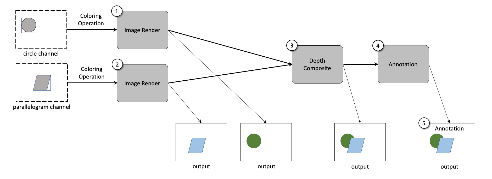

# CIS image proposal

<table>
<tr>
<td></img></td>
<tr>
<td>Diagram of layers and possible composited images. Images can be combined together in many ways, depending upon the information that is included, as well as the capabilities of the consumer of the data.</td>
</tr>
</table>

- **image** 
    - required: (width, height) [int, int]
    - required: origin (0,0) point 
        - default is ll 
    - required: 0 or more **layers**
    - required: 0 or more **images** 

- **layer**
    - required: name [string]
        - reserved names include [depth, shadow]
        - depth: depth value for layer
        - shadow: shadow value for layer
    - required: (width, height) [int, int]
    - required: (x,y) [int, int] offset from its image's origin
        - when offset, the layer's contents may be outside the image's (w,h)

# Example

- **image**
    - **layer**
        - name: overlay
        - layer: overlay
    - **layer**
        - name: background
        - layer: background
    - **image**
        - name: circle
        - layer: depth
        - layer: shadow
        - layer: density
        - layer: pressure
        - layer: temperature
    - **image**
        - name: paralelleogram
        - layer: depth
        - layer: shadow
        - layer: density
        - layer: pressure
        - layer: temperature
